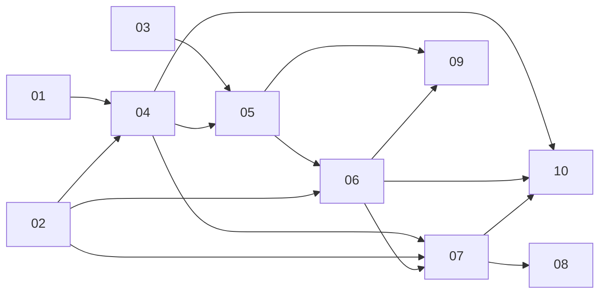

# Phases

| # | Spec | Code | Status |
|---|------|------|--------|
| 01 | [State](./01-state.md) | — | Draft |
| 02 | [Library](./02-library.md) | — | Planned |
| 03 | [Actions](./03-actions.md) | — | Planned |
| 04 | [Types](./04-types.md) | `src/game/**` types | Planned |
| 05 | [Engine](./05-engine.md) | engine, provider, hooks | Planned |
| 06 | [Tasks](./06-tasks.md) | task systems | Planned |
| 07 | [Selectors](./07-selectors.md) | selectors, derived hooks | Planned |
| 08 | [Tower UI](./08-tower-ui.md) | `Building` | Planned |
| 09 | [Persistence](./09-persistence.md) | save/load | Planned |
| 10 | [Overlay](./10-overlay.md) | header HUD | Planned |

Review specs **01 → 03** before code. **04–07** need no UI. **08** first visible change.

**Out of scope:** inventory, Craft/Gathering pages, Web Worker, backend.
