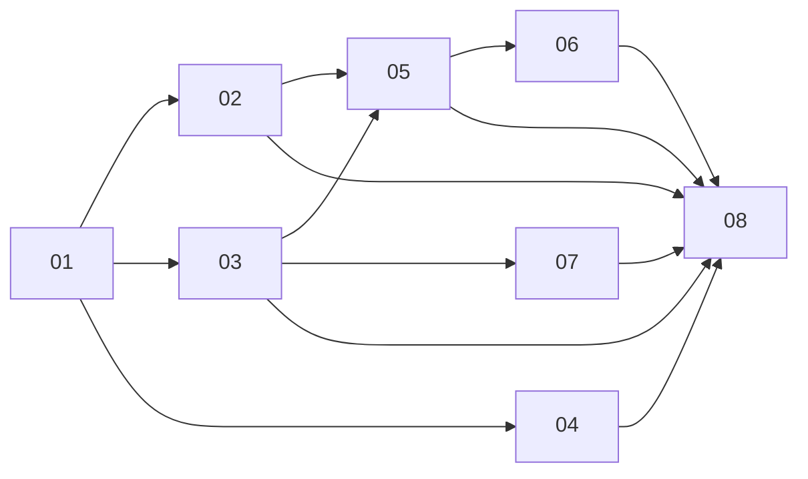

# Phases

| # | Spec | Code | Status |
|---|------|------|--------|
| 01 | [Boundaries & goals](./01-boundaries-goals.md) | `src/game/**`, `src/components/**`, `src/navigation/**`, `src/pages/**` | Done |
| 02 | [Single source of truth](./02-single-source-of-truth.md) | shared domain constants/selectors | Done |
| 03 | [Guaranteed skill state](./03-guaranteed-skill-state.md) | `state`, `persist`, `migration` | Done |
| 04 | [Navigation option lifecycle](./04-navigation-option-lifecycle.md) | `src/navigation/**` | Done |
| 05 | [BL/UI responsibility split](./05-bl-ui-responsibility-split.md) | selectors + workshop UI | Done |
| 06 | [Component simplification](./06-component-simplification.md) | book/workshop components | Done |
| 07 | [Migration isolation](./07-migration-isolation.md) | `src/game/persist/migration/**` | Done |
| 08 | [Validation & cleanup](./08-validation-cleanup.md) | lint/typecheck + regression checks | Done |

Execution order: lock domain contracts first (**02–04**), then simplify UI on top (**05–06**), then isolate migration concerns (**07**), then run full cleanup and acceptance (**08**).
