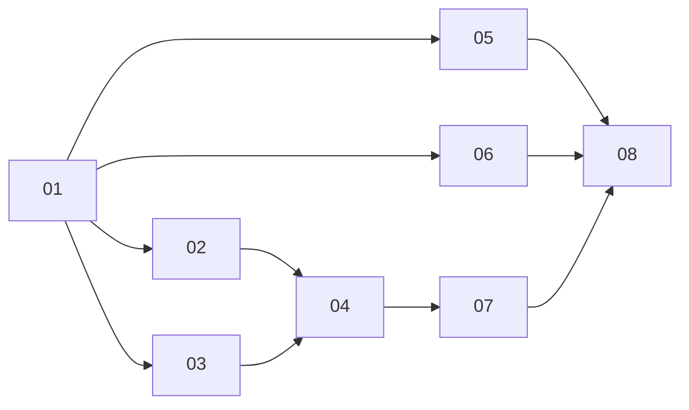

# Phases

| # | Spec | Code | Status |
|---|------|------|--------|
| 01 | [Current state audit](./01-current-state-audit.md) | renderer, runtime, UI/state boundaries | Done |
| 02 | [Rendering pipeline decision](./02-rendering-pipeline-decision.md) | `src/engine/**`, `src/pages/Tower/**` | Done |
| 03 | [Runtime and asset cleanup](./03-runtime-and-asset-cleanup.md) | unused runtime, duplicate Spine assets | Done |
| 04 | [Tower scene consolidation](./04-tower-scene-consolidation.md) | remove legacy DOM tower path | In progress |
| 05 | [UI composition boundaries](./05-ui-composition-boundaries.md) | `src/components/**`, `src/pages/**` | In progress |
| 06 | [Game-state boundary cleanup](./06-game-state-boundary-cleanup.md) | `src/game/**`, navigation/page options | Planned |
| 07 | [GPU and render-cost optimization](./07-gpu-render-cost-optimization.md) | Pixi app init, Spine scheduling | In progress |
| 08 | [LOC reduction and validation](./08-loc-reduction-and-validation.md) | deduplication + acceptance checks | Planned |

Execution order: lock the renderer direction first (**01-02**), remove dead paths (**03-04**), restore strict boundaries (**05-06**), then optimize frame cost and finish with LOC/validation (**07-08**).
